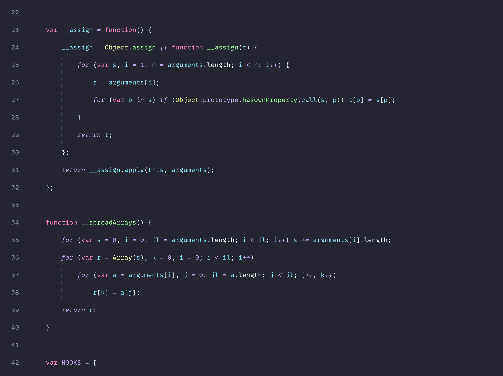
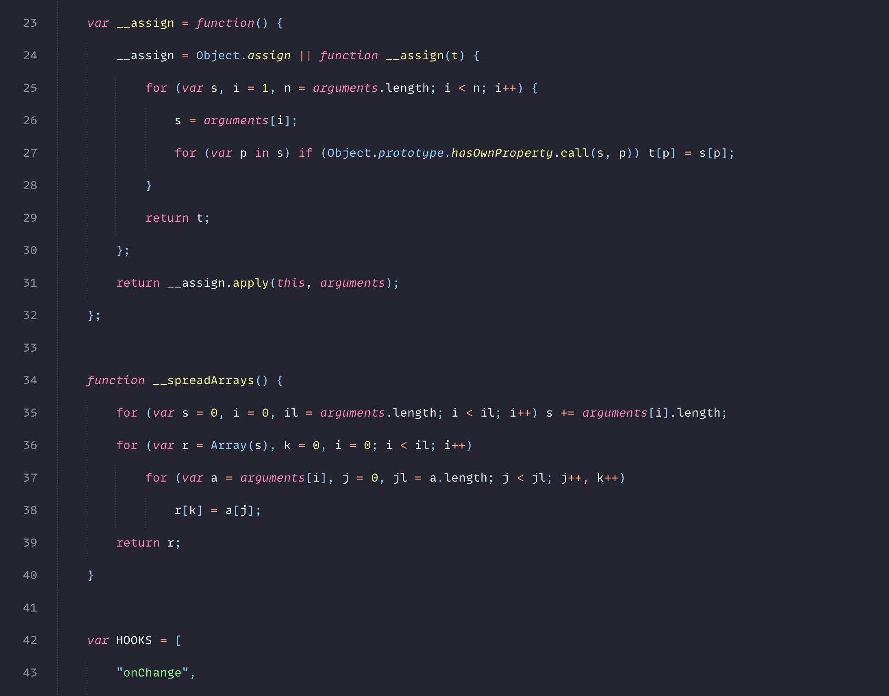
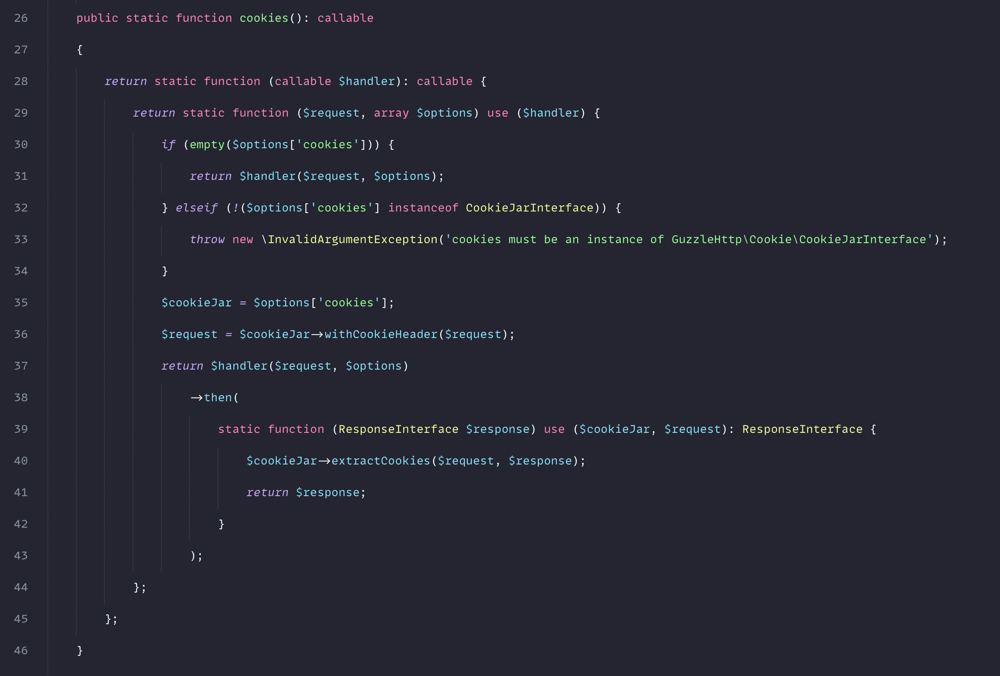
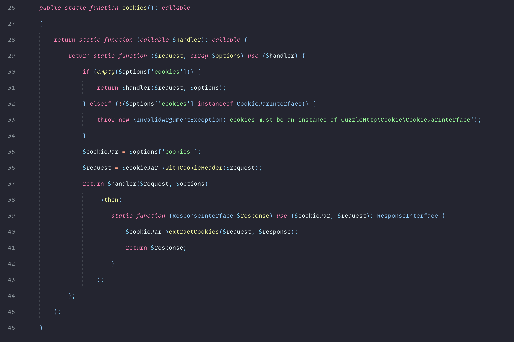

# Coddy Theme
Colorful Sublime Text color scheme and it's totally free
### Javascript
Rainbow


Default


### PHP
Rainbow


Default


## Installation
This theme not available in Package Control yet, so I recommend you to manually clone this theme into your Package Control folder. You can find that through Sublime Text under `Preferences > Browse Packages...` or the Command Palette and copy the `.sublime-color-scheme` to Packages
```bash
git clone https://github.com/codetickdev/coddy.git
```
## Love it?
We are on the same vibe then! You can follow me on Twitter [@codetickdev](http://twitter.com/codetickdev) - let's connect.
